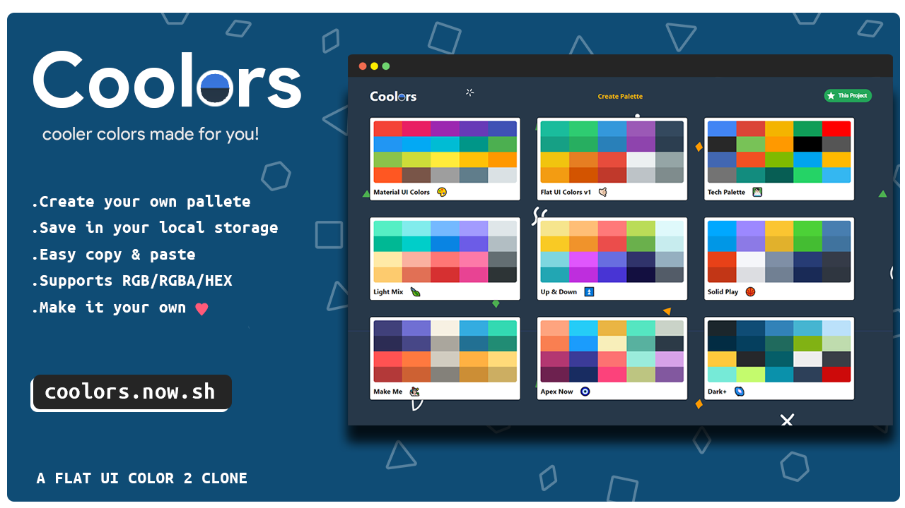

# Coolors 🎨
### Cooler ❄  colors made for you !  [check it out]

## Overview 👀

- **Create Your Own Pallete 🎨‍**
- **Everything Synced to Your Local Storage 🔁**
- **Copy RGB/RGBA/HEX Color Codes Directly To Your Clipboard 📋**
- **Sortable Colors 🤹🏻‍♀️**
- **Get Each and Every Shade of Color 💅🏻**
- **Clean UI & Beautiful Animation  ⚡**

## Tech Stack 👨🏻‍💻

- [react] - **Frontend Libraray**
- [material-ui] - **UI Library**
- [react-copy-to-clipboard] - **To copy color code to clipboard**
- [react-router-dom] - **For client side routing**
- [react-sortable-hoc] - **Sortable color box**
- [react-transition-group] - **Route Transistions**
- [chroma-js] - **For all color handling**
- [emoji-mart] - **Emoji Picker**

## Run Locally 🏠

#### 0. `clone this repo` & `cd into repo` ✔
####  1. `npm install` then `npm start` ✔
#### Open [http://localhost:3000](http://localhost:3000) to view it in the browser.

## Acknowledgement 🙇🏻‍♂️
#### This Project is a clone of [FLAT UI COLORS 2] and special thanks for [Colt Steele] for his react course. 🙏🏻

[Colt Steele]:<https://www.youtube.com/channel/UCrqAGUPPMOdo0jfQ6grikZw>
[FLAT UI COLORS 2]:<https://flatuicolors.com/>
[Check it out]:<https://coolors.now.sh/> 
[react]:<https://reactjs.org/>
[material-ui]:<https://material-ui.com/>
[react-copy-to-clipboard]:<https://www.npmjs.com/package/react-copy-to-clipboard>
[react-router-dom]:<https://www.npmjs.com/package/react-router-dom>
[react-sortable-hoc]:<https://www.npmjs.com/package/react-sortable-hoc>
[react-transition-group]:<https://www.npmjs.com/package/react-transition-group>
[chroma-js]:<https://vis4.net/chromajs/>
[emoji-mart]:<https://www.npmjs.com/package/emoji-mart>